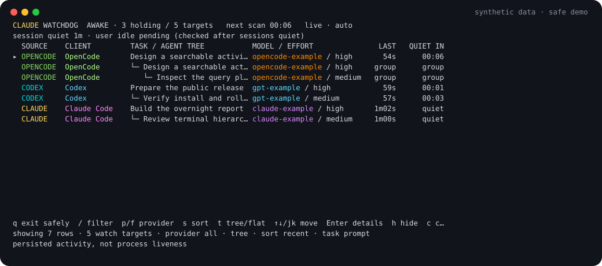

# claude-watchdog

[](https://github.com/ugiya/claude-watchdog/actions/workflows/ci.yml)
[](https://www.python.org/downloads/)
[](LICENSE)

Keep your Mac awake while local coding-agent sessions remain active, then let
it sleep after the sessions and the user have both been quiet.

`claude-watchdog` is an experimental, standard-library-only Python utility for
Claude Code, compatible Claude wrappers, Codex CLI/App sessions, OMX logs, and
OpenCode. Its terminal dashboard shows the sessions responsible for the wake
assertion, including recorded parent/child relationships, current models, and
quiet-time countdowns. When the dashboard closes, it leaves a plain terminal
report explaining the final decision.



The demo uses synthetic data. The accompanying [terminal recording](docs/demo.cast)
can be played with an asciinema-compatible player.

> [!WARNING]
> A normal run executes `pmset sleepnow` after all configured guards pass.
> Start with `--dry-run`. The watchdog reads persisted activity timestamps; it
> does not determine whether a process is alive, whether a task completed, or
> whether a model is still generating output. It cannot guarantee sleep or wake
> behavior while a Mac notebook lid is closed.

## Requirements

- macOS
- Python 3.10 or later
- Local agent session data from at least one [supported source](#supported-sources)

The runtime has no third-party Python dependencies.

## Install

Clone the repository and install the executable under your own prefix:

```bash
git clone https://github.com/ugiya/claude-watchdog.git
cd claude-watchdog
python3 scripts/install.py --prefix ~/.local
```

Ensure `~/.local/bin` is on `PATH`, then verify the command:

```bash
claude-watchdog --help
```

The installer refuses to replace a modified destination unless you explicitly
pass `--force`. To remove the installed executable:

```bash
python3 scripts/install.py --prefix ~/.local --uninstall
```

This project is distributed as a source executable; it is not a Python package
and does not use `pip` for installation.

### Using uv

If you use [uv](https://docs.astral.sh/uv/getting-started/installation/),
it can select or download Python and run this dependency-free source directly.
After cloning the repository:

```bash
uv python install 3.14
uv run --no-project --python 3.14 python claude-watchdog --help
uv run --no-project --python 3.14 python claude-watchdog --dry-run
```

`--no-project` avoids loading an enclosing Python project's dependencies.
To install or uninstall through the same interpreter:

```bash
uv run --no-project --python 3.14 python scripts/install.py --prefix ~/.local
uv run --no-project --python 3.14 python ~/.local/bin/claude-watchdog --help
uv run --no-project --python 3.14 python scripts/install.py --prefix ~/.local --uninstall
```

The installed executable still uses `python3` from `PATH` when invoked directly.
Use the explicit `uv run ... python` form above if you rely on uv-managed Python.
There is no package to install with `uv tool install`; use the source and installer.
See [uv's script guide](https://docs.astral.sh/uv/guides/scripts/) for interpreter
selection and script execution details.

## First run

Start an agent session, then run the watchdog in dry-run mode:

```bash
claude-watchdog --dry-run
```

By default it:

1. admits sessions with persisted activity from the previous 15 minutes;
2. discovers additional recently active sessions every 60 seconds;
3. keeps the Mac awake with an owned `caffeinate` process;
4. waits until all watched sources have had no persisted activity for 30
   minutes;
5. checks that macOS reports at least five minutes of user inactivity;
6. releases `caffeinate`, restores the terminal, and prints a final report;
7. logs the sleep request without executing it because `--dry-run` is active.

After you have inspected that behavior, omit `--dry-run` to allow the final
`pmset sleepnow` request.

Useful examples:

```bash
# Watch only Codex and OMX, with a 20-minute session quiet period.
claude-watchdog 20 --source codex-omx --dry-run

# Disable the separate macOS user-idle requirement.
claude-watchdog --user-idle-minutes 0 --dry-run

# Keep the launch-time watch set fixed and use plain log output.
claude-watchdog --session-discovery frozen --display log --dry-run

# Avoid using Claude's last prompt as a fallback dashboard label.
claude-watchdog --task-label metadata --dry-run
```

Run `claude-watchdog --help` for every option.

## Dashboard controls

| Key | Action |
| --- | --- |
| `j`, `k`, arrows | Move the selected row |
| `/` | Edit the text filter; `Enter` accepts and `Esc` cancels |
| `p`, `f` | Cycle the provider filter |
| `s` | Cycle recent, title, and source sorting |
| `t` | Toggle tree and flat presentation |
| `Enter` | Toggle details for the selected row |
| `c` | Clear text and provider filters |
| `q`, `Ctrl-C` | Exit safely without requesting sleep |

Filters, sorting, and tree presentation change only the display. Hidden rows
remain in the watch set and continue to affect the sleep decision.

## Supported sources

| Source | Activity data | Scope |
| --- | --- | --- |
| Claude Code | JSONL under `~/.claude/projects` | Parent transcripts and native `subagents/agent-*.jsonl` children |
| Claudex | JSONL in the Claude data tree beside the resolved `claudex` executable | Separate Claude-family guard |
| Marjory | JSONL in the Marjory data tree beside the resolved `marjory` executable | Separate Claude-family guard |
| Codex CLI/App | Rollout JSONL under `$CODEX_HOME/sessions` or `~/.codex/sessions` | Recursively discovered rollout files |
| OMX | JSONL under `~/.omx/logs` | Only identities admitted from shared logs |
| OpenCode | SQLite at `$OPENCODE_DB`, or the XDG OpenCode data directory | Admitted root sessions and their recursive descendants |

Provider formats are private implementation details that may change without
notice. See [compatibility and schema evidence](docs/compatibility.md) before
assuming a particular agent release is supported.

## What “active” means

The safety-critical signal is the newest valid timestamp stored in attributable
JSONL content or OpenCode database records. Filesystem modification time and
process presence do not drive the sleep decision. A row marked `holding` means
that its persisted activity is recent enough to prevent sleep; it does not mean
the process is running.

Live discovery is additive. Once a target is admitted, it remains watched for
the run. OpenCode keeps its launch-time lineage roots and includes newly created
descendants of those roots. OMX keeps admitted identities within shared logs.

The dashboard reads extra metadata for labels and hierarchy, but metadata
failures do not change the activity calculation. The watchdog exits without
requesting sleep when safety-critical activity or macOS presence cannot be read
reliably.

## Agent trees and external lineage

Native Claude, Codex, and OpenCode parent identifiers appear as a `pstree`-style
hierarchy when both parent and child are visible. Codex parsing preserves the
child's own first `session_meta` identity when forked transcripts contain an
inherited parent record.

Shell-launched cross-provider children do not necessarily record a native
parent. An optional `~/.config/claude-watchdog/lineage.json` can declare an
exact relationship for Claude-family and Codex sessions:

```json
{
  "version": 1,
  "links": [
    {
      "child": {"source": "codex", "session_id": "child-session-id"},
      "parent": {"source": "claude", "session_id": "parent-session-id"},
      "evidence": "review launcher recorded both session IDs"
    }
  ]
}
```

The registry affects presentation only. Entries must resolve to one visible
parent and one visible child; conflicts, ambiguity, unsupported sources, and
malformed files are ignored. The file is limited to 256 KiB and 256 links.

## Logs and privacy

The watchdog writes plain operational logs to `~/claude-watchdog.log`. Session
prompts, task titles, project paths, model names, and session identifiers can
appear in the dashboard, final report, or logs. Treat all of these as sensitive.

Before sharing a screenshot or issue report, redact:

- prompts and task titles;
- usernames and local paths;
- session and thread identifiers;
- repository names and proprietary model/provider details.

Do not attach raw agent transcripts. Metadata displayed in the terminal is
sanitized to remove control characters, but sanitization is not anonymization.

## Project status

`v0.1.0` is an experimental public prerelease. The repository has regression
coverage for parsers, watch-set scoping, power-command ordering, dashboard
rendering, and isolated lifecycle behavior. That coverage does not establish
compatibility with every agent release or prove real-world sleep behavior on
every Mac.

- [Compatibility evidence](docs/compatibility.md)
- [Architecture and safety boundaries](docs/architecture.md)
- [Contributing](CONTRIBUTING.md)
- [Security policy](SECURITY.md)
- [Changelog](CHANGELOG.md)

## License

MIT. See [LICENSE](LICENSE).
